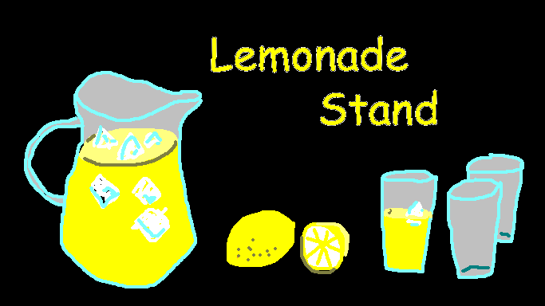

# Lemonade Stand

Logic based on the [possibly-wrong python translation](https://github.com/possibly-wrong/lemonade) of the old Apple game Lemonade Stand.

Lemonade Stand is one of the first games I remember playing on the internet in the 90s. 

# Goals
- Not to scope creep by adding lots of features to start with
- Give it that 90s internet look
- Organize it so it makes sense when I pick it up later
- Use web layout, not javascript canvas
- Make it quickly

